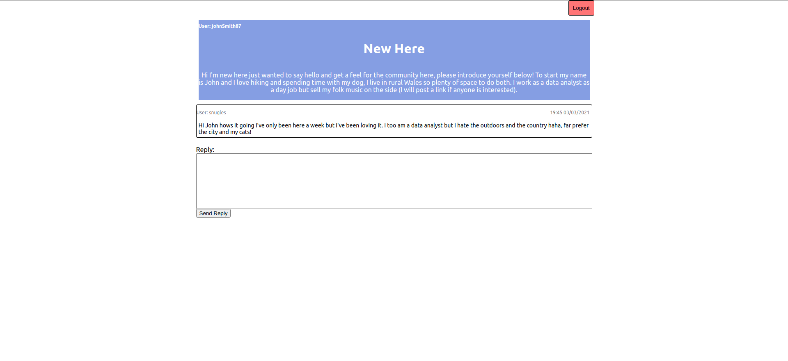

# forumlise
A fairly general purpose forum based around topic threads built for typescript, redux and SQL database practice.

### Features

User accounts used to assign both users and replies to individual users. Login and register screens both availible on the client.

Home page lists all topics from all users allowing easy viewing, also allows users to post new topics as long as they are logged in.

individual threads track their own replies and allow users to view and reply themselves.

### Tech Stack
Front end
- React
- Typescript
- Redux

Backend
- Sequelize based on a PostgreSQL database
- Typescript
- Sequilize migrations
- Node.js with express

### How to Run Forumlise
1. Download the repository and npm i in both the server and client folders

2. Create a config.json copy pasting the contents of mockconfig.json (remember to replace the USER and PASSWORD fields with your details). Do the same for the .env file and mock.env.txt (This [website]https://onlinerandomtools.com/generate-random-string is useful for generating strings if you set it to "All letters a-zA-Z and numbers" but anything works).

3. Migrate the database up by running npx sequelize db:migrate in the server folder

4. Run npm start in both client and server folders then navigate to localhost:3000 in browser when they compile.

5. Profit
